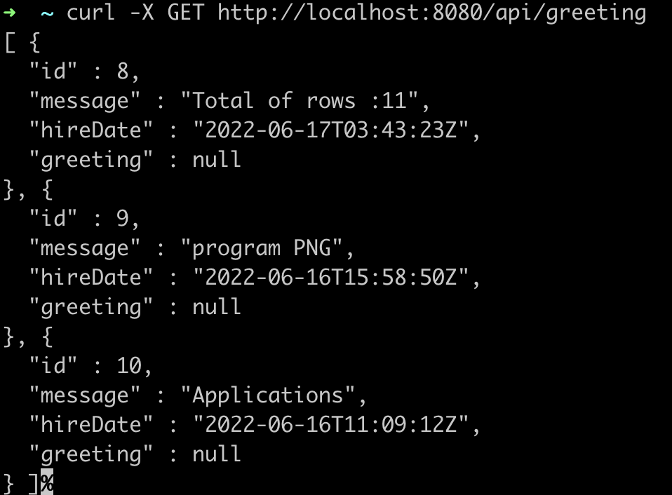
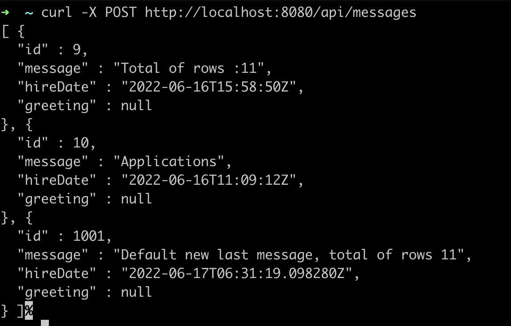

# Andres Munoz Genome code challenge
This is a "microservice" application intended to be part of a microservice architecture, please refer to the page of the documentation for more information.
This application is configured for Service Discovery and Configuration with . On launch, it will refuse to start if it is not able to connect to .





## Project Structure

Node is required for generation and recommended for development. `package.json` is always generated for a better development experience with prettier, commit hooks, scripts and so on.

`/src/*` structure follows default Java structure.

- `/src/main/docker` - Docker configurations for the application and services that the application depends on

## Development

To start your application in the dev profile, run:

```
./gradlew
```
```
docker-compose -f src/main/docker/jhipster-control-center.yml up
```

## Building for production

### Packaging as jar

To build the final jar and optimize the genome application for production, run:

```
./gradlew -Pprod clean bootJar
```

To ensure everything worked, run:

```
java -jar build/libs/*.jar
```

Refer to [Using in production][] for more details.

### Packaging as war

To package your application as a war in order to deploy it to an application server, run:

```
./gradlew -Pprod -Pwar clean bootWar
```

## Testing

To launch your application's tests, run:

```
./gradlew test integrationTest jacocoTestReport
```

For more information, refer to the [Running tests page][].

### Code quality

Sonar is used to analyse code quality. You can start a local Sonar server (accessible on http://localhost:9001) with:

```
docker-compose -f src/main/docker/sonar.yml up -d
```

Note: we have turned off authentication in [src/main/docker/sonar.yml](src/main/docker/sonar.yml) for out of the box experience while trying out SonarQube, for real use cases turn it back on.

You can run a Sonar analysis with using the [sonar-scanner](https://docs.sonarqube.org/display/SCAN/Analyzing+with+SonarQube+Scanner) or by using the gradle plugin.

Then, run a Sonar analysis:

```
./gradlew -Pprod clean check jacocoTestReport sonarqube
```

For more information, refer to the [Code quality page][].

## Using Docker to simplify development (optional)

You can use Docker to improve your development experience. A number of docker-compose configuration are available in the [src/main/docker](src/main/docker) folder to launch required third party services.

For example, to start a postgresql database in a docker container, run:

```
docker-compose -f src/main/docker/postgresql.yml up -d
```

To stop it and remove the container, run:

```
docker-compose -f src/main/docker/postgresql.yml down
```

You can also fully dockerize your application and all the services that it depends on.
To achieve this, first build a docker image of your app by running:

```
./gradlew bootJar -Pprod jibDockerBuild
```

Then run:

```
docker-compose -f src/main/docker/app.yml up -d
```
